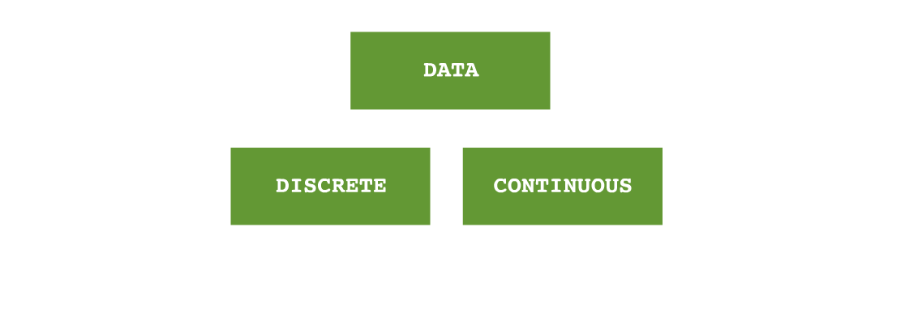

<a href="binomial-probability-distributions.html" class="button small">Binomial Probability Distributions</a>
<a href="poisson-probability-distributions.html" class="button small">Poisson Probability Distributions</a>

<a href="/quality-management">&#x2190; Back to Quality Management</a>

Control Charts are the visual representation of data. There are numerous types of control charts. The chart you choose depends on the data you're working with. Below is an outline that describes this.

If your data is continuous (it has no limits), then you would typically calculate as a "normal distribution", If it is discrete, and there are data limits, then you could use "Binomial" or "Poisson" distributions.

Likewise, for continuous data, you might present using an I-MR chart, for example, while discrete data may use a "p" chart.

<a href="/quality-management">&#x2190; Back to Quality Management</a>
