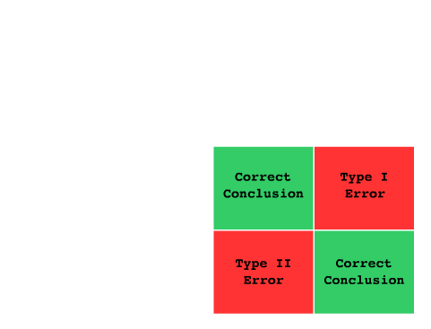

<a href="central-limit-theorem.html" class="button small">Central Limit Theorem</a>
<a href="central-tendency.html" class="button small">Central Tendency</a>
<a href="standard-deviation.html" class="button small">Standard Deviation</a>
<a href="process-capability.html" class="button small">Process Capability</a>
<a href="rmsd.html" class="button small">RMSD</a>
<a href="chi.html" class="button small">Chi</a>
<a href="error-types.html" class="button special small">Error Types</a>

<a href="/quality-management">&#x2190; Back to Quality Management</a>

Errors can occur for one of two reasons.  As shown in the image below, if a control chart suggests that an adjustment to the process should occur and a change in the process did indeed occur during the duration of the chart, then the conclusion is correct.  Likewise, if no changes are made following the result of a control chart and no change in process has occurred for the duration, then the conclusion is also correct.

Now, if there are <code>special causes</code> in a control chart and the reader decides to make an adjustment to the process, but no changes to the process occurred during the duration of the chart, then this is a <code>Type I</code> error.  It is not the correct course of action to amend a process due to special causes.  Adjusting a process needlessly can result in the increased rejection of good components.

Additionally, if the reader of the chart chooses to make no adjustments to the process, but the process has indeed changed during the duration of the chart, then this is a <code>Type II</code> error.

----

## Simple Explanation

<b>Type I Error</b>: A fire alarm keeps sounding when there are no fires leading to inconvenience.  The effects are an increase in cost due to frequent changes.  In ths context of a control chart, we have unnecessary adjusting of in-control process.

<b>Type II Error</b>: A fire occurred but the alarm did not sound.  The effects, here, are that defects may be produced.  In the context of a control chart, we are not recognizing that the process has changed.

<a href="/quality-management">&#x2190; Back to Quality Management</a>
